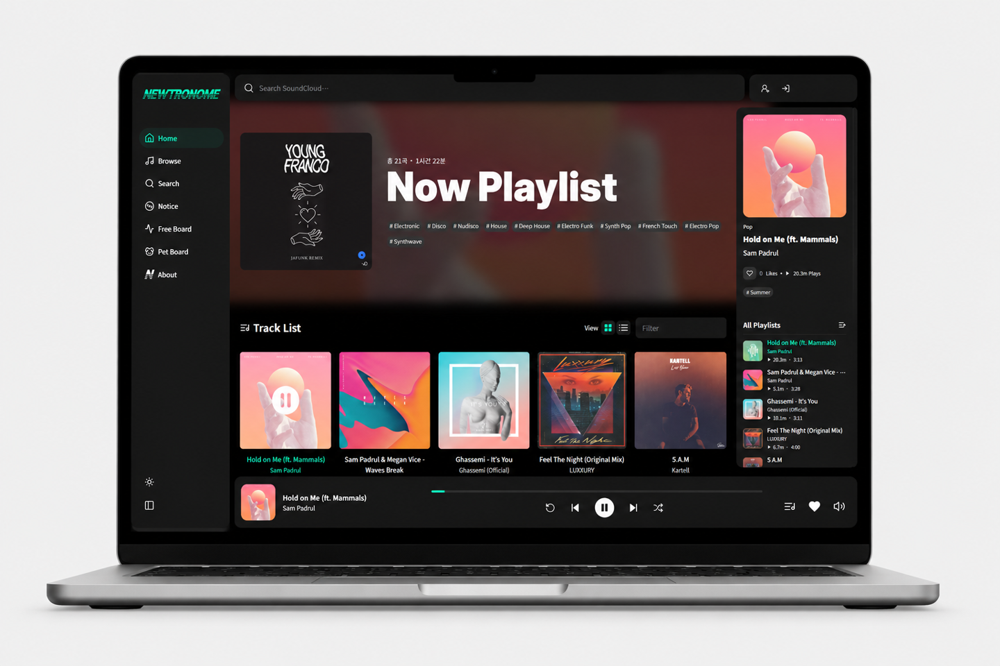
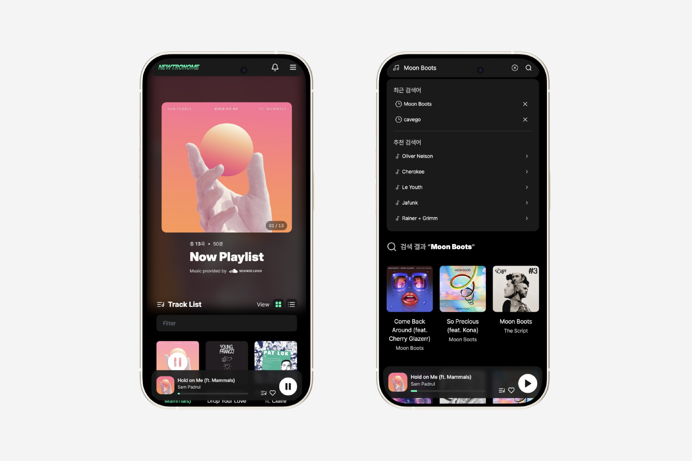

# Newtronome

[서비스 바로가기](https://newtronome.jsjweb0.workers.dev/) · [GitHub](https://github.com/jsjweb0/newtronome)

SoundCloud 플레이리스트 재생과 iTunes 곡 검색·미리듣기를 제공하는 음악 서비스입니다. 재생 상태 관리, 외부 API 연동, 사용자별 트랙 저장과 게시판을 구현한 개인 프로젝트입니다.

## 화면 미리보기





## 주요 기능

- **음악 재생**: SoundCloud 플레이리스트 재생, 이전·다음·랜덤 이동, 현재 곡과 재생 시간 표시
- **검색·미리듣기**: iTunes 곡 검색, 최근·추천 검색어, 검색 결과 추가 표시, SoundCloud 재생과 미리듣기의 상호 정지
- **트랙 저장**: 로그인 사용자별 Likes 목록 관리, 저장한 곡을 한 곡씩 재생하고 재생이 끝나면 자동 정지
- **인증·게시판**: 회원가입·로그인, 게시글·댓글 작성, 작성한 글과 댓글 조회
- **반응형·접근성**: 화면 크기에 따른 목록·패널 배치, 검색 폼과 재생 버튼의 키보드 조작 및 상태를 반영한 접근성 레이블

## 기술 스택

| 구분        | 사용 기술                                        |
| ----------- | ------------------------------------------------ |
| 프론트엔드  | React, TypeScript, Vite, Tailwind CSS            |
| 상태 관리   | Zustand, React Context                           |
| 인증·데이터 | Firebase Authentication, Firestore               |
| 음악 연동   | SoundCloud Widget API, iTunes Search API         |
| 테스트      | Vitest, Testing Library, Playwright              |
| 배포        | Cloudflare Workers Static Assets, GitHub Actions |

## 주요 구현과 문제 해결

### SoundCloud 재생 구조 개선

기존에는 비공식 API 요청으로 플레이리스트와 스트림 URL을 조회했습니다. SoundCloud의 Client ID나 요청 규격이 바뀌면 재생이 중단돼 설정을 다시 확인해야 했습니다.

공식 Widget API로 전환해 SoundCloud Client ID 관리와 스트림 URL 변환을 없앴습니다. Widget 인스턴스와 이벤트 연결은 `useSoundCloudWidget` 훅이 맡고, 여러 화면이 공유하는 현재 곡·재생 여부·재생 시간은 Zustand 스토어에서 관리합니다. 하단 플레이어와 플레이리스트 패널은 필요한 상태를 구독합니다.

외부 재생 장치와 화면 상태를 분리해 관리했습니다. 음악 검색은 iTunes로 분리했습니다.

### 검색·재생의 비동기 충돌 방지

연속 검색이나 빠른 곡 전환에서는 이전 요청이 늦게 완료되어 최신 화면을 덮어쓸 수 있습니다. 검색은 `AbortController`로 이전 요청을 취소하고, 이전 요청이 끝난 뒤에도 로딩 상태를 바꾸지 않도록 현재 요청인지 확인합니다. 곡 정보 조회와 미리듣기 재생은 요청 번호를 비교해 오래된 응답을 무시합니다.

미리듣기가 시작되면 SoundCloud 재생을 정지하고, SoundCloud 재생 이벤트가 발생하면 미리듣기를 정지합니다. 새 검색이나 페이지 이동 시에는 요청과 오디오 상태를 정리합니다. 요청을 취소해도 이미 시작된 작업의 결과가 돌아올 수 있어, 요청 번호로 최신 요청만 반영했습니다.

### 데이터 검증과 로딩 처리

TypeScript 타입은 런타임 값의 형태까지 보장하지 않으므로 iTunes 응답과 Firestore 문서를 런타임에서 검증·변환합니다. 잘못된 검색 항목이나 Firestore 문서는 제외하고, 저장 트랙의 형식 오류는 오류 상태로 전달합니다. 플레이리스트는 로딩·빈 목록·오류를 구분하고, 빈 목록이 확정되면 이전 곡과 재생 시간을 초기화하도록 테스트했습니다.

### 게시판 데이터 계층 분리

기존 `PostsProvider`는 Firestore 데이터 접근과 React 캐시 관리를 함께 담당했습니다. Firestore 호출과 데이터 변환을 서비스 계층으로 옮겨 Provider는 상태와 캐시 관리만 맡도록 역할을 나눴습니다. 조회 상태 관리 방식을 바꾸더라도 서비스 함수는 그대로 사용할 수 있습니다.

일부 페이지를 지연 로딩하고, Preline에서 필요한 Dropdown 모듈만 불러오도록 구성했습니다.

## 테스트

```bash
npm run typecheck
npm run lint
npm run test:run
npm run build
```

브라우저 테스트는 최초 실행 전 Chromium을 설치합니다.

```bash
npx playwright install chromium
npm run test:e2e
```

- **훅·컴포넌트 테스트**: 늦게 도착한 곡 정보·재생 시간 응답, 미리듣기 재생 요청의 성공·실패 순서, 빈 목록 상태 정리
- **브라우저 테스트**: 데스크톱·모바일 Chromium에서 목록 로딩, 곡 선택·키보드 일시정지, 빈 목록, 오류·시간 초과 후 재시도

브라우저 테스트는 실제 앱을 실행하되 SoundCloud 응답과 이벤트를 제어합니다. 실제 서버 연결, 음원 출력, 브라우저 자동재생 정책은 별도로 확인해야 합니다.

## 폴더 구조

```txt
src/
  assets/          이미지, 폰트, 전역 스타일
  components/      공통 UI와 레이아웃
  contexts/        인증, 테마, 토스트, 알림 상태
  features/
    board/         게시판 URL 처리와 Firestore 연동
    bookmarks/     저장 트랙 UI와 데이터 처리
    itunes/        검색·미리듣기와 API 응답 검증
    player/        Widget 연동 훅, 스토어, 타입
  hooks/           공통 훅
  layouts/         페이지 레이아웃
  pages/           인증, 게시판, 사용자 페이지
  utils/           포맷팅과 데이터 변환
public/mock/       로컬 게시글·댓글 목업
workers/           프론트엔드 Worker
tests/e2e/        브라우저 테스트
firestore.rules    Firestore 접근 제어 규칙
wrangler.toml      Cloudflare 배포 설정
```

## 설치·실행·배포

```bash
npm install
npm run dev
```

프론트엔드는 Cloudflare Workers Static Assets로 배포합니다. `main` 브랜치에 변경 사항이 올라가면 GitHub Actions가 Cloudflare Workers와 GitHub Pages에 자동 배포합니다.

수동 배포:

```bash
npx wrangler login
npm run build
npm run frontend:deploy
```

## 알려진 제약과 향후 개선

- iTunes 검색은 미국 스토어 기준이며, 최대 100개 결과를 받아 20개씩 표시합니다.
- 플레이리스트 전체 로딩은 Widget 내부 렌더링 방식에 의존하므로 곡 수나 Widget 동작이 바뀌면 다시 확인해야 합니다.
- Firebase와 공통 의존성을 별도 청크로 분리하고, 마이페이지의 로딩·오류 상태 테스트를 보강할 예정입니다.
- 실제 SoundCloud 음원 출력과 주요 브라우저 호환성을 추가로 검증할 예정입니다.
